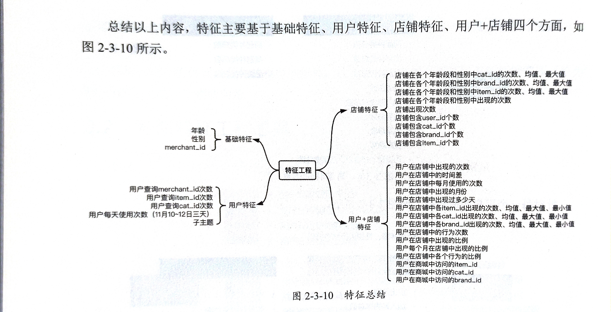
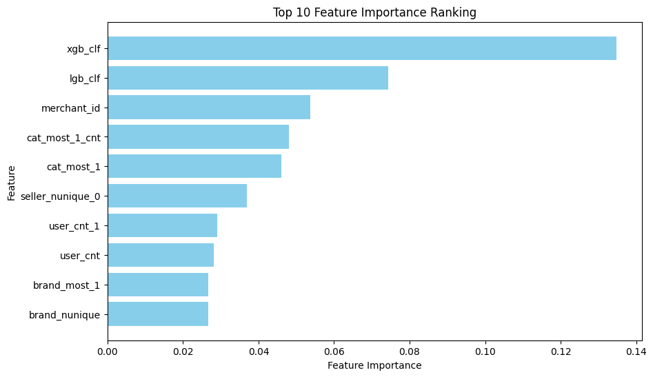

# 代码在https://github.com/doo0ooG/Business-Intelligence-Third-Homework

# 第三次作业-天猫复购预测-挑战Baseline

**数据请在https://tianchi.aliyun.com/competition/entrance/231576/information下载并解压，把目录`data_format1`重命名为`data`并拷贝到本目录下**

### 2108080217 调包侠-余睿

<hr>

## 参考材料


- 问题来源：https://tianchi.aliyun.com/competition/entrance/231576

- 数据集来源：https://tianchi.aliyun.com/competition/entrance/231576/information

- 《阿里云天池大赛赛题解析——机器学习篇》

## 版权声明

本项目中的所有代码和文档，我放弃对该项目的所有代码和文档的版权。

您可以自由地使用、复制、修改、合并、出版、分发、授权、销售和/或以其他方式使用此软件的副本，而无需获得本软件的作者的许可。但请注意，此声明放弃了作者对本软件的版权，因此您使用本软件的风险自负。

如果您认为该项目侵犯了您的版权或其他知识产权，请与我联系，我将尽快删除相关内容。

# 目录

- [问题分析](#问题分析)
- [数据探索](#数据探索)
- [特征工程](#特征工程)
- [模型训练](#模型训练)
- [模型验证](#模型验证)
- [特征优化](#特征优化)


## 1.问题分析

共有如下四个数据文件

```cmd
test_format1.csv
train_format1.csv
user_info_format1.csv
user_log_format1.csv
```

#### 用户画像数据`user_info_format1`

| 字段名称  | 描述                                            |
| --------- | ----------------------------------------------- |
| user_id   | 购物者的唯一ID编码                              |
| age_range | 用户年龄范围。                                  |
| gender    | 用户性别。0表示女性，1表示男性，2和NULL表示未知 |

#### 用户行为日志`user_log_format1`

| 字段名称    | 描述                                                         |
| ----------- | ------------------------------------------------------------ |
| user_id     | 购物者的唯一ID编码                                           |
| item_id     | 商品的唯一编码                                               |
| cat_id      | 商品所属品类的唯一编码                                       |
| merchant_id | 商家的唯一ID编码                                             |
| brand_id    | 商品品牌的唯一编码                                           |
| time_stamp  | 购买时间（格式：mmdd）                                       |
| action_type | 包含{0, 1, 2, 3}，0表示单击，1表示添加到购物车，2表示购买，3表示添加到收藏夹 |

#### 训练集/测试集`train_format1/test_format1`

| 字段名称    | 描述                                                         |
| ----------- | ------------------------------------------------------------ |
| user_id     | 购物者的唯一ID编码                                           |
| merchant_id | 商家的唯一ID编码                                             |
| label       | 包含{0, 1}，1表示重复买家，0表示非重复买家。测试集这一部分需要预测，因此为空。 |

## 2.数据探索

时间不够

## 3.特征工程

### 3.1.读取数据 合并数据

### 3.2.基于统计学提取特征

基于统计学提取特征是指从数据集中使用统计学方法和技巧来构建新的特征，以帮助机器学习模型更好地理解和预测数据。这种方法通常涉及对数据的统计属性进行计算和分析，以生成具有信息量的特征。这些统计属性可以包括均值、方差、中位数、分位数、偏度、峰度等。提取的特征可以是原始特征的函数，也可以是对数据进行转换或组合而得到的新特征。

基于统计学提取特征的过程可以涉及以下步骤：

1. 数据理解：了解数据的分布、属性和特点，确定哪些统计属性可能对建模任务有帮助。

2. 特征提取：根据数据的统计属性构建新的特征，例如计算数值型特征的统计指标、文本数据的词频、类别型特征的频次等。

3. 特征选择：对提取的特征进行选择，筛选出对任务有用的特征，以减少维度和模型复杂度，避免过拟合。

4. 特征转换：对特征进行转换或组合，以提高特征的表达能力或增强特征之间的相关性，例如使用多项式特征、交叉特征等。

基于统计学提取特征是机器学习和数据挖掘中常用的一种方法，它能够帮助模型从原始数据中提取出更有价值的信息，提高模型的性能和泛化能力。



### 3.3.基于`Countvector`和`TF-IDF`提取特征

基于CountVectorizer和TF-IDF（Term Frequency-Inverse Document Frequency）提取特征是自然语言处理中常用的两种方法，用于将文本数据转换为数值特征。

1. **CountVectorizer特征提取**：
   - CountVectorizer是一种简单的词袋模型，它将文本文档转换为词频向量。
   - 对于每个文档，CountVectorizer统计每个词在文档中出现的次数，然后将这些词频作为特征向量的元素。
   - 这样得到的特征向量是高维稀疏的，维度数量等于所有文档中出现的不同单词数量。

2. **TF-IDF特征提取**：
   - TF-IDF是一种用于衡量一个词对于一个文档在语料库中的重要程度的方法。
   - TF（Term Frequency，词频）衡量了一个词在文档中出现的频率，即该词在文档中出现的次数除以文档中所有词的总数。
   - IDF（Inverse Document Frequency，逆文档频率）衡量了一个词在整个语料库中的重要程度，即语料库中文档的总数除以包含该词的文档数量的对数。
   - TF-IDF值是TF和IDF的乘积，表示一个词在文档中的重要性，如果一个词在当前文档中出现频繁但在整个语料库中出现较少，则它的TF-IDF值较高。
   - 对于一个文档，TF-IDF特征向量中的每个元素代表了相应词的TF-IDF值。

在实践中，可以使用scikit-learn库中的`CountVectorizer`和`TfidfVectorizer`来实现CountVectorizer和TF-IDF特征提取。这些特征提取器通常与机器学习模型一起使用，以将文本数据转换为数值特征，从而进行分类、聚类等任务。

### 3.4.嵌入特征

嵌入特征（embedding features）是指将高维的离散型数据（如单词、类别等）映射到低维的连续型向量空间中的特征表示。在自然语言处理（NLP）中，嵌入特征通常用于将文本数据转换为向量表示，以便机器学习模型能够更好地理解和处理文本信息。

嵌入特征的一个常见应用是将单词映射到向量空间中的词嵌入（word embeddings）。词嵌入是通过训练神经网络模型来学习得到的，其目标是将语义上相似的单词映射到相近的向量空间中，以便模型可以利用单词之间的语义关系进行学习和推理。例如，通过词嵌入，可以将“king”和“queen”这样的词语映射到相近的向量空间中，因为它们在语义上是相似的。

除了词嵌入之外，嵌入特征还可以用于表示其他类型的数据，如类别型特征、图像特征等。通过将离散型数据映射到连续型向量空间中，嵌入特征能够捕获数据之间的相关性和结构信息，从而提高机器学习模型的性能和泛化能力。

总的来说，嵌入特征是一种重要的特征表示方法，它能够有效地将复杂的高维数据转换为低维连续型向量表示，从而为机器学习模型提供更丰富和有效的输入信息。

### 3.5.`Stacking`特征

Stacking特征（Stacking features）是一种集成学习（ensemble learning）技术，通过结合多个基础模型的预测结果来创建新的特征，以提高模型的性能和泛化能力。

Stacking的基本思想是将多个不同模型的预测结果作为新的特征，然后将这些特征与原始特征一起输入到最终的元模型（Meta-model）中进行训练。元模型通常是一个简单的线性模型，用于融合不同模型的预测结果，从而得到最终的集成预测结果。

Stacking特征的一般步骤如下：

1. **基础模型训练与预测**：首先，将训练数据划分为多个子集，在每个子集上训练不同的基础模型（例如决策树、支持向量机、随机森林等），然后使用这些模型对测试数据进行预测。

2. **生成新特征**：将基础模型在训练数据和测试数据上的预测结果作为新的特征，这些预测结果可以是原始的类别标签、概率值或其他衡量模型输出的特征。

3. **训练元模型**：使用原始特征和基于基础模型预测结果生成的新特征作为输入，训练一个元模型（通常是一个线性模型），用于组合和融合这些特征，以生成最终的集成预测结果。

Stacking特征可以有效地捕获不同模型之间的差异性和互补性，从而提高模型的性能和泛化能力。它是一种强大的集成学习技术，经常在数据竞赛和实际应用中被使用。

### 3.6.使用决策树查看特征排名



## 4.模型训练

## 5.模型验证

## 6.特征优化